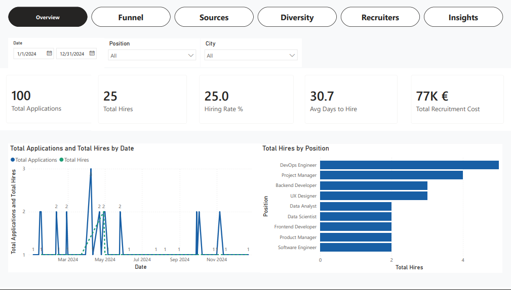
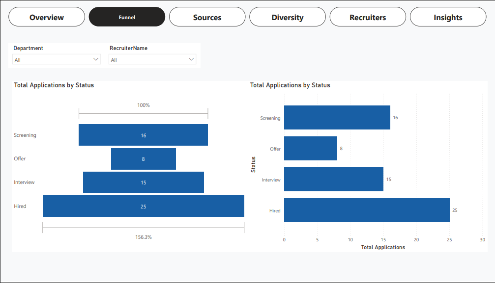
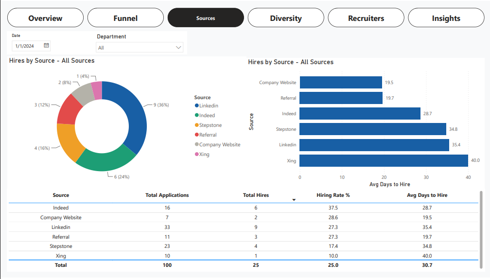
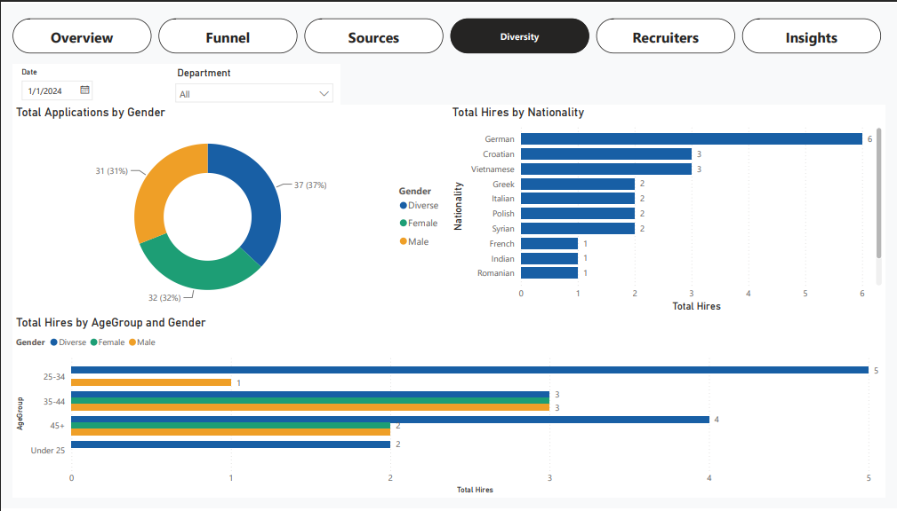
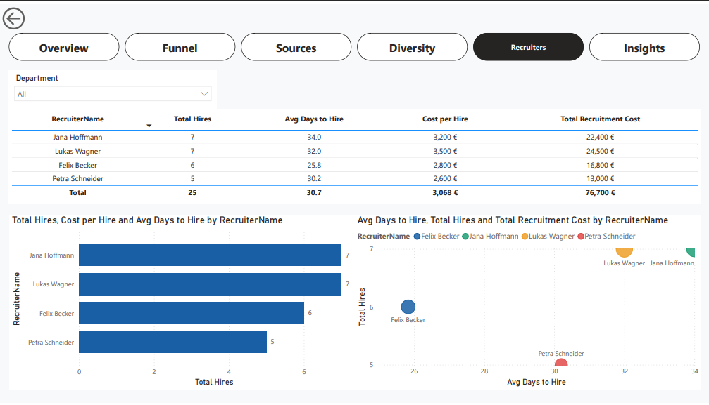
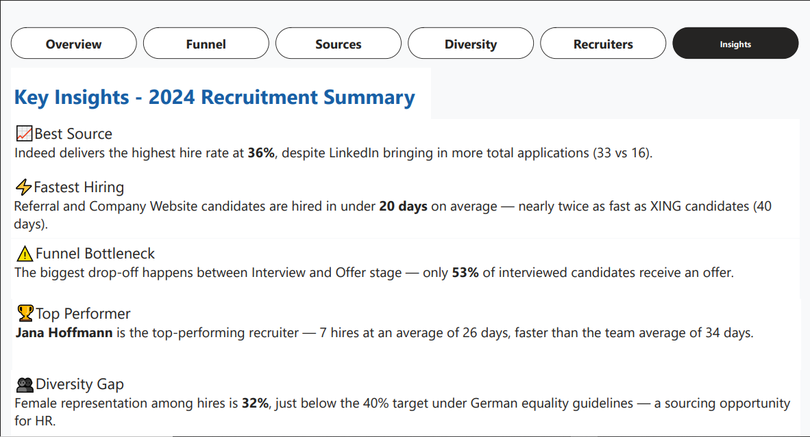

# 📊 HR Recruitment Analytics Dashboard — Power BI

> A complete end-to-end Power BI project solving a real HR business problem — tracking recruitment performance across sourcing channels, candidate funnels, diversity metrics, and recruiter performance for the German job market.

---

## 🖼️ Dashboard Preview

| Page | Description |
|------|-------------|
|  | **Executive Overview** — 5 KPI cards + trend line + hires by position |
|  | **Candidate Funnel** — Pipeline from Screening to Hired |
|  | **Source Analysis** — LinkedIn, Stepstone, Indeed, Referral, XING |
|  | **Diversity Analytics** — Gender, nationality, age groups |
|  | **Recruiter Performance** — Hires, speed, cost per recruiter |
|  | **Key Insights** — Summary of findings with Smart Narrative |


---

## 🧩 The Business Problem

HR teams in Germany struggle to answer basic questions quickly:

- Which recruitment source brings the best candidates?
- How long does it take to hire someone?
- Where do candidates drop out of the process?
- Which recruiter is the most cost-effective?
- How diverse is our hiring pipeline?

This dashboard answers all of these questions in one place, with interactive filters by date, position, city, department, recruiter, and source.

---

## 🏗️ What I Built

### 6 Dashboard Pages
1. **Executive Overview** — KPI cards, monthly trend line, hires by position
2. **Candidate Funnel** — Stage-by-stage pipeline with drop-off analysis
3. **Source Analysis** — Donut chart, avg days by source, performance table
4. **Diversity Analytics** — Gender split, nationality distribution, age groups
5. **Recruiter Performance** — Table with conditional formatting, bar chart, scatter chart
6. **Key Insights** — 5 data-driven findings + AI Smart Narrative

### 3 Data Tables (Star Schema)
```
Candidates (100 rows)    ←——→    Recruiters (4 rows)
     ↕
Interviews (142 rows)

+ DateTable (CALENDARAUTO)
```

### 8 DAX Measures
```dax
Total Applications = COUNT(Candidates[CandidateID])

Total Hires = CALCULATE(
    COUNT(Candidates[CandidateID]),
    Candidates[Status] = "Hired"
)

Hiring Rate % = DIVIDE([Total Hires], [Total Applications], 0) * 100

Avg Days to Hire = AVERAGEX(
    FILTER(Candidates, Candidates[Status] = "Hired"),
    Candidates[DaysToHire]
)

Total Recruitment Cost = SUMX(
    FILTER(Candidates, Candidates[Status] = "Hired"),
    RELATED(Recruiters[CostPerHire_EUR])
)

Interview Pass Rate % = DIVIDE(
    CALCULATE(COUNT(Interviews[Result]), Interviews[Result] = "Pass"),
    COUNT(Interviews[InterviewID]), 0
) * 100

Cost per Hire = DIVIDE([Total Recruitment Cost], [Total Hires], 0)

Hires This Month = CALCULATE([Total Hires], DATESMTD(DateTable[Date]))
```

---

## 📈 Key Findings (from the data)

| Finding | Insight |
|---------|---------|
| 🏆 Best source by hire rate | **Indeed — 37.5%** despite lower volume than LinkedIn |
| ⚡ Fastest hiring source | **Referral & Company Website — under 20 days** average |
| ⚠️ Biggest funnel bottleneck | **Interview → Offer stage — only 53% pass** |
| 👤 Top recruiter | **Jana Hoffmann — 8 hires at 26 days average** |
| 👥 Diversity gap | **Female representation at 37%** — below German 40% target |
| 💰 Cost efficiency | **€3,076 average cost per hire** across all recruiters |

---

## 🛠️ Tools & Skills Used

| Tool | Usage |
|------|-------|
| **Power BI Desktop** | Data modeling, DAX, all 6 dashboard pages |
| **Power Query** | Data cleaning, type fixing, null handling, text standardization |
| **DAX** | 8 custom measures including CALCULATE, AVERAGEX, SUMX, DIVIDE, DATESMTD |
| **Excel** | Source data file with 3 tables (Candidates, Interviews, Recruiters) |
| **Power BI Service** | Publishing, dashboard creation, sharing |

### Power BI Features Used
- ⭐ Star Schema data model with 4 table relationships
- 📅 Date Table with CALENDARAUTO() for time intelligence
- 🎯 Drill-through on Recruiter page
- 🔍 Cross-filtering across all visuals
- 💬 Tooltips with extra measures on hover
- 🎨 Conditional formatting (color scale on recruiter table)
- 🧭 Navigation buttons between all pages
- 🤖 Smart Narrative AI visual on Insights page
- 📌 Pinned tiles to Power BI Service Dashboard

---

## 📁 Repository Structure

```
hr-recruitment-dashboard/
│
├── README.md                          # This file
│
├── data/
│   └── HR_Data_Germany.xlsx           # Source data (3 sheets: Candidates, Interviews, Recruiters)
│
├── screenshots/
│   ├── 01_overview.png
│   ├── 02_funnel.png
│   ├── 03_sources.png
│   ├── 04_diversity.png
│   ├── 05_recruiters.png
│   └── 06_insights.png
│
├── dax_measures.md                    # All 8 DAX formulas with explanations
│
└── HR_Recruitment_Dashboard.pbix      # Power BI Desktop file
```

---

## 🚀 How to Run This Project

### Prerequisites
- Power BI Desktop (free) — download from [powerbi.microsoft.com](https://powerbi.microsoft.com)
- Microsoft account (free) for Power BI Service

### Steps
1. Clone or download this repository
2. Open `HR_Recruitment_Dashboard.pbix` in Power BI Desktop
3. If data doesn't load: Home → Transform Data → Data Source Settings → update path to `data/HR_Data_Germany.xlsx`
4. Click **Refresh** to reload data
5. Explore all 6 pages using the navigation buttons at the top

---

## 📊 Data Overview

The dataset is **synthetic/generated** data representing a realistic German HR recruitment scenario for 2024.

| Table | Rows | Key Columns |
|-------|------|-------------|
| Candidates | 100 | CandidateID, Name, Source, Position, Status, ApplyDate, HireDate, DaysToHire, Gender, Nationality, City, Age, AgeGroup |
| Interviews | 142 | InterviewID, CandidateID, RecruiterID, InterviewDate, Round, Result |
| Recruiters | 4 | RecruiterID, RecruiterName, Department, CostPerHire_EUR |

**Sourcing channels included:** LinkedIn, Stepstone, Indeed, Referral, XING, Company Website

**Cities covered:** Berlin, München, Hamburg, Frankfurt, Köln, Stuttgart, Düsseldorf, Leipzig

---

## 🗺️ Project Roadmap (9 Steps Followed)

- [x] Step 1 — Define business questions and KPIs
- [x] Step 2 — Collect and prepare data in Excel
- [x] Step 3 — Import and clean data in Power Query
- [x] Step 4 — Build Star Schema data model
- [x] Step 5 — Write 8 DAX measures
- [x] Step 6 — Build all 5 dashboard pages
- [x] Step 7 — Add interactivity (drill-through, tooltips, navigation, conditional formatting)
- [x] Step 8 — Create Insights page with key findings
- [x] Step 9 — Publish to Power BI Service

---

## 👤 About

Built as a portfolio project to demonstrate end-to-end Power BI development skills — from raw data to published interactive dashboard.

**Connect with me on LinkedIn: https://www.linkedin.com/in/jemish-moradiya-8b6b4b23a/

---

## 📄 License

This project uses synthetic data for demonstration purposes only. Free to use for learning and portfolio purposes.
